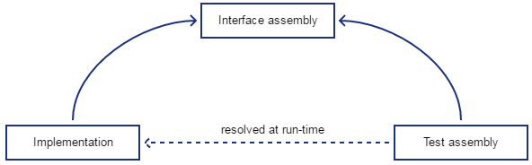

# Writing Tests in Cooperative Projects or When the User Interface Is Designed but Not Implemented

We can split the definition of **Process**, **Page**, and **Control Objects** into *assemblies* with interfaces and implementations:

- **Interfaces** define which controls and operations a page provides. For example, the page `LoginWindow` may have a button `Login` and a method `LoginUser(username, password)`.
  
- **Implementations**, in contrast, specify how these controls are located (e.g., in the DOM tree) and how operations are broken down into action sequences on the page controls or other operations. For example, the button `Login` is located by searching for a control with the tag `a` (a link) and the text "Sign in." A user is logged in via the method `LoginUser`, which involves entering the username and password into the input fields `Username` and `Password`, and finally clicking the button `Login`.

If both layers are separated, the test cases can be defined in another assembly that solely *references the interface layer*, while their implementations are loaded and resolved *dynamically*, i.e., when the test executes.

![decoupling1]

Thus, test cases and page object implementations are *decoupled*.

## What's the Benefit of Decoupling Test Cases and Page Objects?

Decoupling test cases and page objects has several benefits:

- **Better Test Maintenance and Reusability:** If the interface remains unchanged, the same test can be applied to different user interface versions with *no* code or reference changes. For example, if a test invokes the interface method `LoginUser(user, password)` on the page object interface `ILoginWindow`, it does not depend on the specific actions required to log on the user. Adding a checkbox "Accept the terms and conditions" needs to be adapted in the implementation, but the page interface and test code remain unchanged.

- **Tests Can Be Coded When the Product Is Still Under Development:** Tests can be created immediately after the UX team finishes the design and user stories (along with the associated interfaces), and thus *before* the pages' functionality is implemented.

- **Easier Testing for Systems with Many Components Developed Concurrently:** When several components with user interfaces are developed concurrently and then integrated, test cases for that integration can be coded once every component provides its set of page interfaces. A test-driven approach can be realized up to the system level.

## How to Decouple Tests from Page Object Code?

The tests and page objects can be decoupled via interfaces as follows:

1. **Create an Interface Assembly**
   - Create a new assembly for page object interfaces (the "*interface assembly*").
   - Add interfaces for the page objects that should be exposed, e.g., `IMyTab`, `ILink`, `IMenu` for classes `MyTab`, `Link`, and `Menu`, respectively.

2. **Create an Implementation Assembly**
   - Add the interface assembly to the list of referenced projects in the *page object assembly*.
   - Move all tab, control, and page objects into that assembly.
   - Extend the page objects with the respective interface, e.g., `class Menu : PageObject, IChildOf<MyTab>` becomes `class Menu : PageObject, IChildOf<MyTab>, IMenu`.
   - Replace all types returned by these classes with their corresponding interface, e.g., the property `Link Events => Find<Link>...` in the page object `Menu` becomes `ILink Events => Find<ILink>`. The `ILink` will be resolved at runtime.

3. **Adapt the Test Assembly**
   - Ensure that all tests are defined in an assembly separate from the interface or implementation assembly.
   - Make sure this assembly references the interface assembly but *not* the page object assembly directly or indirectly.
   - Replace all usages of page and control object implementations with their corresponding interfaces, i.e., `tab.On<Menu>()` becomes `tab.On<IMenu>()`.
   - Locate the tab object using the `TabObject.Resolve` method, e.g., `var tab = new MyTab()` becomes `var tab = TabObject.Resolve<IMyTab>()`.
   - Finally, ensure the page object assembly is available and loaded, e.g., via `Assembly.LoadFrom`, before tests are executed.

[decoupling]: ./Resources/decoupling.png "coparoo web logo"
